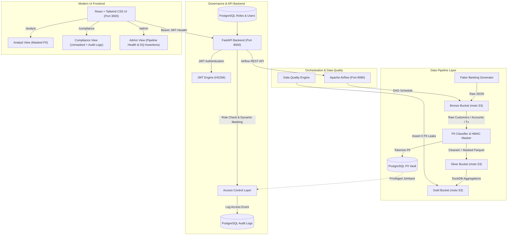

# 🏦 Banking-Grade PII Masking & Access-Controlled Medallion Data Lake

[](https://www.docker.com/)
[](https://fastapi.tiangolo.com/)
[](https://react.dev/)
[](https://tailwindcss.com/)
[](https://airflow.apache.org/)
[](https://duckdb.org/)
[](https://www.postgresql.org/)
[](#-compliance--regulatory-rationale)

A full-stack, open-source medallion architecture data lake featuring a **FastAPI backend with JWT authentication**, a **React + Tailwind CSS frontend portal**, automated HMAC tokenization, Role-Based Access Control (RBAC), and immutable compliance audit logging — **100% free with zero cloud costs**.

---

## 🏗️ Architecture & Component Overview



---

## 🛠️ Free / Local Tech Stack

| Layer | Tool / Technology | Description |
| :--- | :--- | :--- |
| **Frontend UI** | `React 18` + `Tailwind CSS` + `Vite` | Modern, responsive banking portal with role-based page routing, token badges, loading states, and Lucide icon UI components (Port 3000). |
| **API Backend** | `FastAPI` + `PyJWT` | REST API layer providing JWT authentication, endpoint authorization middleware, audit logging, and Airflow health checks (Port 8000). |
| **Object Storage** | `moto (S3 Mock Server)` | Standalone S3-compatible object storage server serving `bronze`, `silver`, and `gold` buckets on port 5001. |
| **Processing Engine** | `DuckDB` + `Pandas` | High-performance in-memory SQL engine for medallion aggregations and Parquet transformations. |
| **PII Engine** | Custom Regex + `HMAC-SHA256` | Deterministic tokenization module with secret key isolation (`HMAC_SECRET_KEY`) and secure vaulting. |
| **Governance DB** | `PostgreSQL 15` | Stores role definitions (`analyst`, `compliance_officer`, `admin`), bcrypt user credentials, `pii_vault` mappings, and `audit_logs`. |
| **Orchestration** | `Apache Airflow 2.8` | Schedules pipeline DAGs and runs automated data quality assertions. |
| **BI Export** | Parquet Export | Gold tables synced to `/powerbi_export/` for Power BI Desktop ingestion. |

---

## 🚀 Quickstart & Setup Guide

### 1. Launch Containers via Docker Compose
```bash
git clone https://github.com/your-username/banking-pii-data-lake.git
cd banking-pii-data-lake
docker compose up --build -d
```

### 2. Access Web Services
* **React Banking Portal:** [http://localhost:3000](http://localhost:3000)
* **FastAPI Swagger Docs:** [http://localhost:8000/docs](http://localhost:8000/docs)
* **Apache Airflow:** [http://localhost:8080](http://localhost:8080) (`admin` / `admin`)
* **Streamlit UI (Legacy):** [http://localhost:8501](http://localhost:8501)
* **moto S3 Mock Server:** [http://localhost:5001](http://localhost:5001)

---

## 👤 Demo Login Credentials & Walkthrough

| User | Password | Role | Access Permissions & Page Features |
| :--- | :--- | :--- | :--- |
| `alice_analyst` | `analyst123` | **Data Analyst** | Access to `/analyst` dashboard. PII fields (`masked_name`, `masked_email`) are visibly masked as HMAC tokens (`TOK_NAME_...`). Access attempts logged in audit trail. |
| `carol_compliance` | `compliance123` | **Compliance Officer** | Access to `/compliance` dashboard. PII fields dynamically unmasked via `pii_vault`. Full access to the searchable/filterable **Compliance Audit Logs** table. |
| `admin_user` | `admin123` | **System Administrator** | Access to `/admin` dashboard. Full access to Gold data, Audit logs, **Airflow Pipeline Health** status, and **Data Quality Assertions** (color-coded pass/fail validation). |

---

## 📜 Compliance & Regulatory Rationale

### 1. GDPR Article 32 (Security of Processing & Pseudonymization)
* **Requirement:** Data controllers must implement appropriate technical measures such as pseudonymization and encryption of personal data.
* **Implementation:** All PII attributes (SSN, Email, Phone, Address, Account Numbers) are converted into deterministic HMAC-SHA256 tokens (`TOK_<TYPE>_<HASH>`). The original mapping is isolated in a separate `pii_vault` table with strict RBAC access.

### 2. PCI-DSS & Dual Control Principles
* **Requirement:** Cardholder and personal banking data must never be stored in plaintext in reporting/analytics data stores.
* **Implementation:** The Gold layer contains zero unmasked PII. Data analysts interact strictly with tokenized representations.

### 3. Banking Regulatory Audit Trails (OCC / FCA / ECB Compliance)
* **Requirement:** Financial institutions must maintain immutable audit logs of who accessed customer data, when, and whether PII was disclosed.
* **Implementation:** Every request through `access_control.py` logs `(timestamp, username, role_name, action, table_accessed, records_returned, pii_exposed)` into PostgreSQL `audit_logs`.
